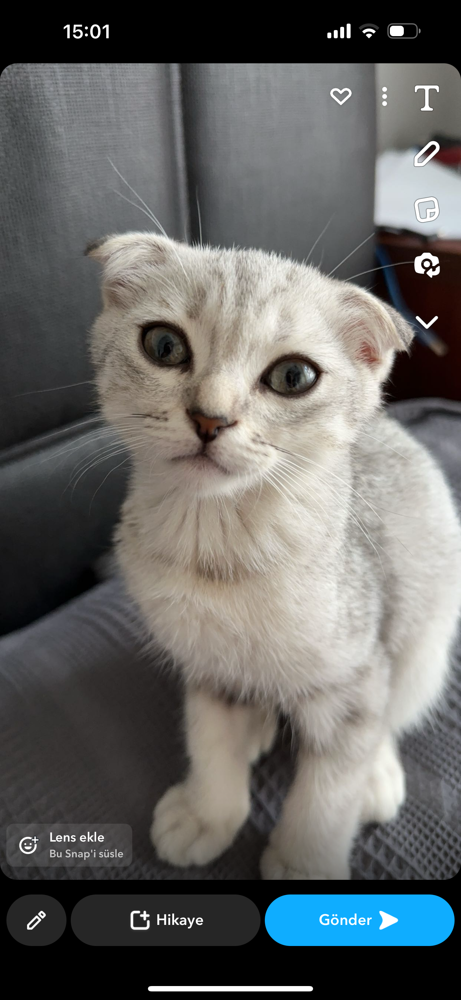

#Kodluyoruz Ilk Repo

Bu repo [Kodluyoruz](https://www.kodluyoruz.org)Front-End Eğitiminde oluşturduğumuz ilk repo. İçersinide bir adet README dosyası, bir adet de index.html barındıyor.


##Installation

Öncelikle projeyi clonelayın.(Buraya sizin reponuzdan aldığınız link gelecek.)

```bash
git clone https://github.com/aysegulakgul/kodluyoruzilkrepo.git
```


##Usage 

Projeyi clonladıktan sonra Visual Studio Code programında açınız. 

Linux için:

```linux
cd kodluyoruzilkrepo
code .
```


##Contributing

Pull requestler kabul edilir. büyük değişiklikler için, lütfen önce neyi değiştirmek istediğinizi tartışmak için bir konu açınız. 

Bu bir değişikliktir.

##Licence

[MIT](https://choosealicense.com/licenses/mit/)


